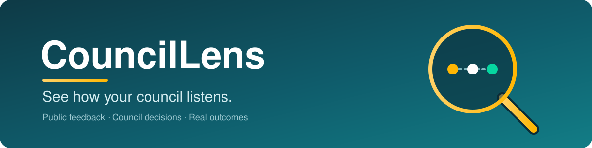
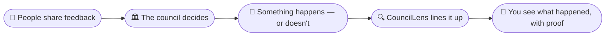

<p align="center">
  
</p>

<p align="center">
  
  
  
  
</p>

<p align="center">
  <b>CouncilLens shows you how your local council's decisions line up with what people asked for — and what actually happened.</b><br>
  No jargon. Every claim comes with a link to the original document.
</p>

---

## 🧭 What is this, really?

Your council publishes a *lot* — meeting notes, consultations, budgets, reports. It is all public, but it is scattered everywhere and written for insiders.

CouncilLens gathers it in one place and turns it into plain English, so you can answer three simple questions:

> **What did people ask for?  ·  What did the council decide?  ·  What actually got done?**

We don't tell you what to think. We lay out the evidence and let you see for yourself.

---

## 🔍 How it works



Behind the scenes we collect public documents, summarise the long ones, and link every single claim back to its source.

---

## 🚦 We're honest about what we can prove

The tricky part of accountability is knowing whether feedback *actually* changed a decision. Often nobody writes that down. So instead of guessing, we label every connection clearly:

|  | Means |
|---|---|
| 🟢 **Confirmed** | The council's own records say this feedback shaped the decision. |
| 🟡 **Possible** | The feedback came first, but we can't prove it caused the decision — so we won't claim it did. |
| ⚪ **No link found** | We didn't find a connection, and we say so plainly. |

This is the heart of CouncilLens: **we would rather say "we don't know" than mislead you.**

---

## 📌 What you'll find

| Page | What it shows |
|------|---------------|
| 🏛️ **Council page** | A friendly overview of one council. |
| 📂 **Topic page** | One issue (like potholes or housing repairs), start to finish. |
| 🕒 **Timeline** | Feedback, decisions and outcomes in order — including "still waiting" where things aren't done yet. |
| 📖 **Methodology** | Exactly how we work, in the open. |

---

## 🤝 What CouncilLens is — and isn't

| ✅ It is | 🚫 It isn't |
|---------|------------|
| A clearer view of public information | A way to score or attack politicians |
| Evidence with links you can check | A source of accusations or rumours |
| Honest about uncertainty | A "black box" you have to trust blindly |
| Built to help scrutiny and discussion | A legal judgement of anyone |

---

## 🗺️ Where we're up to

This is an early build. First milestone: **one council, one topic, done really well.**

- [x] Set up the project
- [ ] Add the first council
- [ ] Add the first topic
- [x] Build the summary pipeline
- [ ] Publish the first pages
- [ ] Add the feedback → decision → outcome view
- [ ] Add an easy corrections process

---

## 🙋 Want to help?

You don't have to be technical. Helpful things anyone can do:

- **Spot something wrong?** Open an *issue* (a note on the project page) and tell us.
- **Know a good public document we've missed?** Share the link.
- **Good with words?** Help make a summary clearer.

If you do write code, please keep changes small, link your sources, and never claim a decision was caused by feedback unless the records prove it.

---

## 🔒 Your data & getting things corrected

We only use **information that is already public**. If you spot a mistake, or you are named and want something looked at, you can ask us to review or remove it — just open an issue or contact the maintainers. We aim to respond promptly.

---

<p align="center">
  <i>CouncilLens is for transparency and public discussion. It does not make legal findings or accuse anyone of wrongdoing.</i><br>
  <sub>Built with care, for residents. 💛</sub>
</p>

<details>
<summary><b>🛠️ For developers</b></summary>

<br>

Static-first and open. The published site regenerates byte-for-byte from cached AI outputs plus raw inputs (the model isn't deterministic, so we cache and version its outputs rather than re-running it live).

```bash
git clone https://github.com/dawsman/councillens.git
cd councillens
# install dependencies (Python + optional Node for the site)
# run the ingest / build commands
# open the local site
```

**Project structure**

```text
data/        raw, processed, ai-cache, schemas
src/         ingest · transform · analyse · ui · publish
pages/       built site content
methodology/ how we work, in the open
docs/        assets (including this README's banner)
.github/     workflows (scheduled ingest + site build)
```

See `methodology/` for the linkage tiers, summary rules, AI provenance fields, and corrections policy.

</details>
