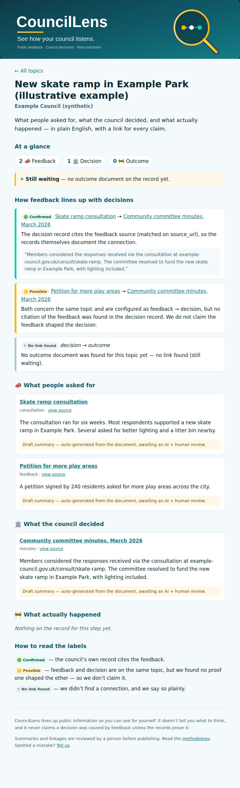

# The publish stage

The publish stage turns the analyse-stage artifacts into the actual
resident-facing website: one page per topic — the **feedback → decision → outcome**
view, with linkage tiers and a link for every claim — plus an index that lists
every council and topic.

```
data/analysis/*.json   →   _site/   (index.html + one <topic>.html each + style.css)
   (analyse stage)            (gitignored — the site is built, not hand-edited)
```

Run it after analyse:

```bash
python src/analyse/analyse.py       # data/analysis/<topic>.json
python src/publish/build_site.py    # _site/
# then open _site/index.html
```

## What it is

- **Static-first and dependency-free.** Plain semantic HTML and one stylesheet —
  no framework, no build toolchain, no JavaScript needed to read a page. This
  keeps it cheap to host, fast, and accessible.
- **Deterministic.** The site is a pure function of the analysis artifacts, so it
  regenerates byte-for-byte. The model is never called here — that already
  happened, cached, in the analyse stage.
- **Council-agnostic.** Like every stage after the canonical record, it renders
  any council's analysis identically. No per-council templates.

## Faithful to the methodology

The renderer is where the project's promises become visible, so it holds to them:

- **A link for every claim.** Every document title links to its public source.
- **Tiers shown honestly.** Each linkage shows its 🟢 / 🟡 / ⚪ tier *and* the
  plain-English reason for it; 🟢 also shows the cited snippet. Tiers are conveyed
  by symbol **and** word, never colour alone (so they read without colour vision).
- **Uncertainty is labelled, not hidden.** Draft (extractive) summaries and
  unreviewed AI summaries are marked as such; a missing stage shows as
  "still waiting" rather than being quietly dropped.
- **No causation beyond the records.** The wording never claims feedback shaped a
  decision unless the tier is 🟢.

## What a topic page looks like



> Rendered from the synthetic "Example Council" fixture (`tests/test_analyse.py`),
> not a real council record — it shows the layout, the three linkage tiers, the
> "still waiting" signal, and the draft-summary flags. The same template renders
> real analyses once ingest runs in an environment with network access.

## Output location

The built site goes to `_site/`, which is gitignored: the published site is an
artifact, regenerated from `data/analysis/` on demand, not hand-edited or
committed. A future deploy step (or CI) publishes `_site/` to the web.
